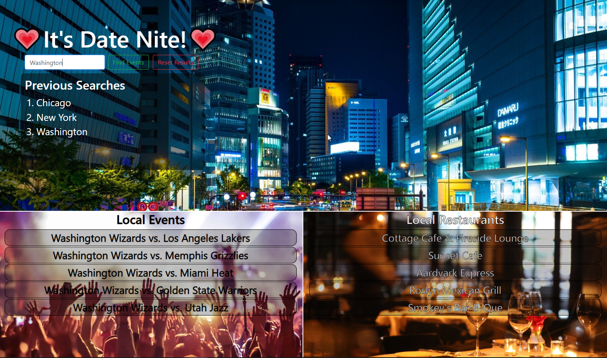

# DateNite
## Description

Datenite will find big local events and the best restaurants in any city the user asks it too. We built this project so that people and their significant others or potential significant others could find easy things to do or places to eat near them immediately. If you are visiting a new city for the first time it can also be used to spontaneously help you find things to do. We were motivated by the challenge of creating a viable website that solved a real world problem. We learned a great deal about using fetch requests to gather data from API's and saving that data to local storage.

## Usage

To use DateNite, its rather simple. Just add a city to the search bar and click submit. If you'd like to search other options make sure to use the refresh button. 

## Credits

David Stewart https://github.com/Dav3ster
David Truitt https://github.com/ddtruitt
Zain Khawaja https://github.com/ZainKhawaja98
Alegro Godley https://github.com/Galegro2022

Yelp Fusion and Ticketmaster Event Discovery API were used in the creation of this project
Yelp Fusion- https://www.yelp.com/developers/documentation/v3/get_started
Ticket Master- https://developer.ticketmaster.com/products-and-docs/apis/discovery-api/v2/

## Deployment link

https://dav3ster.github.io/Date_Nite/
